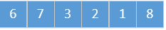
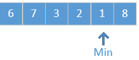
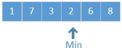
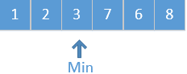
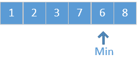
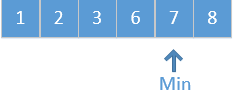
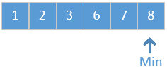

### 选择排序

>  场景：如果有一副被打乱了的扑克，需要你将他们整理成有序的。你会怎么做？

>  回想以前玩扑克的时候，一般都是先选出所有的A放在第一位，再选出所有的2放在第二位，再选出所有的3放在第三位...

同理，在如果在计算机中，需要将一个无序的数组通过某个算法，排列成有序的，那你会怎么做？

回想上面的扑克场景，先选出最小的，放在第一位，再选出剩下最小的，放在第二位。其实，这便是今天所要说的，选择排序。

选择排序很简单，核心便是**每次遍历挑选出最小的数据**

比如数组：                                                 

它的排序过程如下：













到这里，排序已经完成。

再来看看代码：

```java
    @Override
    public void sort(int[] a) {
        final int N = a.length;
        for (int i = 0; i < N; i++) {
            int min = i;//用来寻找集合中最小数字
            for (int j = i + 1; j < N; j++) {
                if (a[j]<a[min]) {
                    min = j;
                }
            }
            SortUtils.swap(a, i, min);
        }
    }

```

代码比较简单，即两层for循环，外层for循环用来确保所有数据都已经被查找，内层for循环用来查找剩下数据中，最小的那个数的坐标。

### 时间复杂度

**遍历时间：** 选择排序的时间复杂度大概能看出是两次for循环，内层一共循环n次，每次内层循环分别为1+2+3+...+n-1次，因此计算得：

T=(n-1)+(n-2)+...+1=(n*(n-1))/2≈O(n^2)

因此需要进行(n*(n-1))/2此比较。

**交换时间：**交换时间和数组原本顺序有关，若原本数组有序，依然要遍历(n*(n-1))/2次，但是交换次数为0，在最差的情况中，每次遍历都会找到最小的值进行交换，就需要交换n-1次。

### 总结

根据代码，我们可以分析一下选择排序的特性：

**核心：**每次找到剩下元素的最小值，依次放在数组中。

**时间复杂度：**选择排序的时间复杂度和数组原本的顺序无关，不关数组原本是否有序，选择排序都会经历两次完整的for循环，因此选择排序的时间复杂度为**O(n^2)**

**稳定性：**在实现过程中，若遇到两个相同的数字，在一些情况下相同数字的顺序可能会被改变：

比如：5 7 5 4 2 根据选择排序的特点：首先2会和第一个5进行交换：2 7 5 4 5 ，经过这样的步骤后，两个5原本的顺序便被改变。因此选择排序是**不稳定**的 

总结出表格如下：

| 时间复杂度  | 空间复杂度 | 稳定性 |
| :---------: | :--------: | :----: |
| 确定 O(n^2) |  确定O(1)  | 不稳定 |


